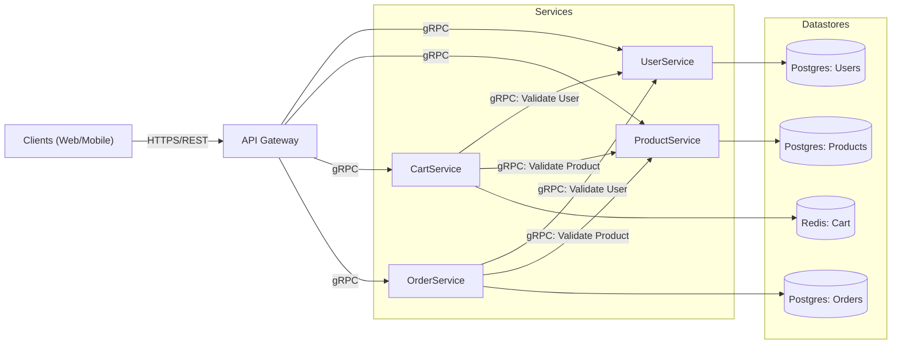

# Services Flow Diagram

```mermaid
flowchart LR
  %% Entry
  Client["Clients (Web/Mobile)"] -->|"HTTPS/REST"| APIGW["API Gateway"]

  %% Services
  subgraph Services
    direction TB
    UserSvc["UserService"]
    ProductSvc["ProductService"]
    CartSvc["CartService"]
    OrderSvc["OrderService"]
  end

  %% Datastores
  subgraph Datastores
    direction TB
    UserDB[("Postgres: Users")]
    ProductDB[("Postgres: Products")]
    OrderDB[("Postgres: Orders")]
    CartCache[("Redis: Cart")]
  end

  %% Gateway to services
  APIGW -->|"gRPC"| UserSvc
  APIGW -->|"gRPC"| ProductSvc
  APIGW -->|"gRPC"| CartSvc
  APIGW -->|"gRPC"| OrderSvc

  %% Service dependencies
  CartSvc -->|"gRPC: Validate User"| UserSvc
  CartSvc -->|"gRPC: Validate Product"| ProductSvc
  OrderSvc -->|"gRPC: Validate User"| UserSvc
  OrderSvc -->|"gRPC: Validate Product"| ProductSvc

  %% Persistence
  UserSvc --> UserDB
  ProductSvc --> ProductDB
  OrderSvc --> OrderDB
  CartSvc --> CartCache
```
